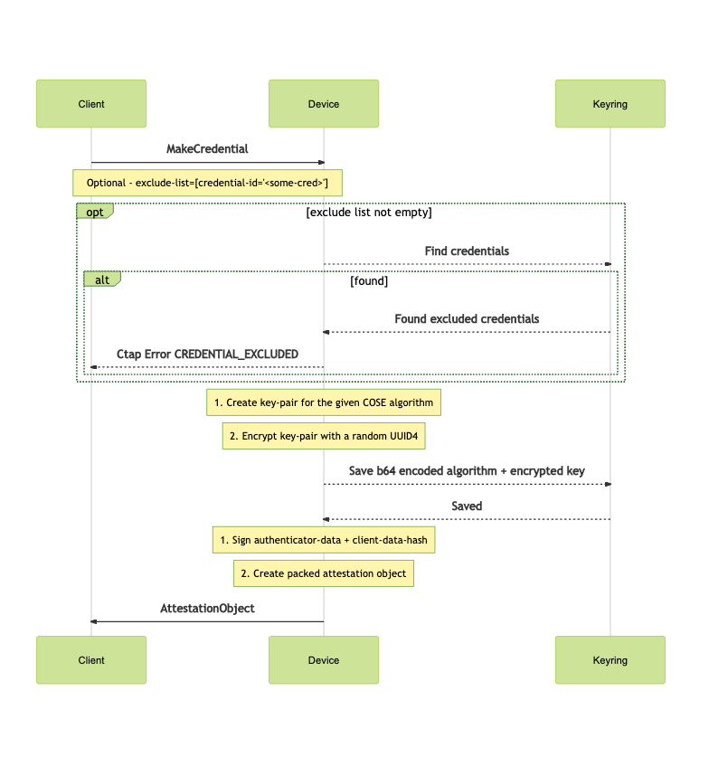
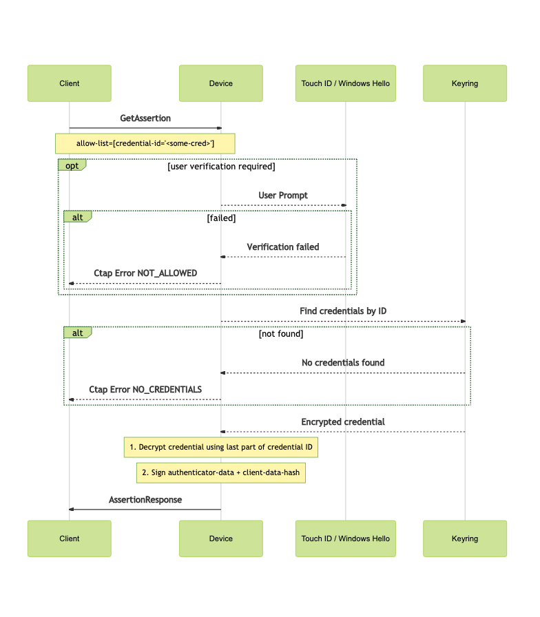

.. image:: https://img.shields.io/pypi/v/ctap-keyring-device.svg
   :target: https://pypi.org/project/ctap-keyring-device
   :alt: PyPi version

.. image:: https://img.shields.io/pypi/pyversions/ctap-keyring-device.svg
   :alt: Python version

.. image:: https://img.shields.io/badge/code%20style-black-000000.svg
   :target: https://github.com/psf/black
   :alt: Code style: Black

.. image:: https://readthedocs.org/projects/ctap-keyring-device/badge/?version=latest
   :target: https://ctap-keyring-device.readthedocs.io/en/latest/?badge=latest
   :alt: Read the docs

.. image:: https://img.shields.io/github/workflow/status/dany74q/ctap-keyring-device/CI
   :alt: CI workflow

This library provides an implementation of a virtual CTAP2 (client-to-authenticator-protocol)
device, which uses the `keyring <https://github.com/jaraco/keyring>`_ library as its backend.

One may use this implementation as a reference for CTAP2-compatible devices,
or to use ones host machine as an authenticator, rather than using an external one.

A common use-case would be to use this library as an authenticator for a webauthn flow,
storing keys and retrieving assertions on a machine's configured keyring.

Supported features are:
 * The make-credential, get-assertion, get-next-assertion and get-info CTAP2 flows
 * The management of keys using the following COSE algorithms: RS1, RS256, PS256, EC256, EdDSA
 * The use of any available keyring as a backend for the created key-pairs (e.g. WinCred, Keychain, ...)
 * User presence & verification on OSX and Windows, via Touch-ID and Windows-Hello
 * Storing keys in a secure manner, with no PII (personal-identifying-information) attached to them

|

Installation
============

Run the following (on a darwin machine)::

    $ pip install ctap-keyring-device

|

Using This Library
==================

Make Credential Flow
********************

.. code-block:: python

    from fido2.webauthn import PublicKeyCredentialCreationOptions, PublicKeyCredentialType, PublicKeyCredentialParameters
    from ctap_keyring_device.ctap_keyring_device import CtapKeyringDevice
    from fido2.client import Fido2Client
    from fido2 import cose
    import base64

    device = CtapKeyringDevice.list_devices()[0]
    origin = 'https://rp.pasten.com'
    client = Fido2Client(device, origin)

    rp = {'id': 'pasten.com', 'name': origin[8:], 'icon': '...'}
    user = {'id': 'danny@pasten.io', 'name': 'Danny Shemesh', 'icon': '...', 'displayName': 'Danny Pastanny'}
    challenge = base64.b64encode(b'my-challenge')
    timeout_ms = 30_000

    pub_key_cred_params = [PublicKeyCredentialParameters(PublicKeyCredentialType.PUBLIC_KEY, cose.ES256.ALGORITHM)]
    options = PublicKeyCredentialCreationOptions(rp, user, challenge, pub_key_cred_params, timeout=timeout_ms)

    attestation, client_data = client.make_credential(options)

|

Get Assertion Flow
******************
.. code-block:: python

    from fido2.webauthn import PublicKeyCredentialRequestOptions, PublicKeyCredentialType, \
        PublicKeyCredentialParameters, PublicKeyCredentialDescriptor, UserVerificationRequirement
    from ctap_keyring_device.ctap_keyring_device import CtapKeyringDevice
    from fido2.client import Fido2Client
    from fido2 import cose
    import base64

    device = CtapKeyringDevice.list_devices()[0]
    origin = 'https://rp.pasten.com'
    client = Fido2Client(device, origin)

    challenge = base64.b64encode(b'my-challenge')
    rp = {'id': 'pasten.com', 'name': origin[8:], 'icon': '...'}
    credential_id = b'.......'
    allow_list = [
        PublicKeyCredentialDescriptor(PublicKeyCredentialType.PUBLIC_KEY, credential_id)
    ]
    timeout_ms = 30_000

    pub_key_cred_params = [PublicKeyCredentialParameters(PublicKeyCredentialType.PUBLIC_KEY, cose.ES256.ALGORITHM)]
    options = PublicKeyCredentialRequestOptions(challenge=challenge, rp_id=rp['id'],
                                                allow_credentials=allow_list, timeout=timeout_ms,
                                                user_verification=UserVerificationRequirement.PREFERRED)
    assertions, client_data = client.get_assertion(options)

|

See examples in ``ctap-keyring-device/tests``.

|

CTAP Flow Diagrams
==================

Make Credential Flow
********************

|

Get Assertion Flow
******************

|

Security Considerations
=======================

Using this library will help one utilize their machine's keyring as a CTAP2-compliant FIDO authenticator.

Credentials are stores on the configured keyring, which defaults to a sensible implementation,
per the platform the code is running on (e.g. keychain on OSX, WinCred on Windows, ...)

The make-credentials flow will create a key-pair for signing, using the requested `COSE algorithm <https://www.iana.org/assignments/cose/cose.xhtml#algorithms>`_.

Private keys are encrypted with a random UUID4 as the passphrase, using hazmat's `BestAvailableEncryption <https://cryptography.io/en/latest/hazmat/primitives/asymmetric/serialization/#cryptography.hazmat.primitives.serialization.BestAvailableEncryption>`_.

Credential IDs comprise of <UUID5-of-user-id>_<key-passphrase>, and are sent back to the requesting client;
it is assumed that the credential ID is kept in a remote machine, and is always provided in the
allow-list of a ctap get-assertion request.

The above allows us to generate and store our keys in a manner that renders key exposure as less risky,
due to the key being encrypted; and not storing the user-id directly, making it harder to use the key,
even if decrypted.

On top of the mentioned safeguards, one may request the UV (user-verification) option,
in order to trigger a 2nd factor before returning an assertion; Touch-ID / Password prompt
is used on OSX, and Windows-Hello on Windows.

|

Making Releases
===============

A CI/CD pipeline is setup on github - once a PR is merged to master, a pre-release
will be automatically deployed to github;
When a release is tagged, it will be automatically deployed to pypi.

|

Running Tests
=============

To run the tests locally, install and invoke
`tox <https://pypi.org/project/tox>`_.
